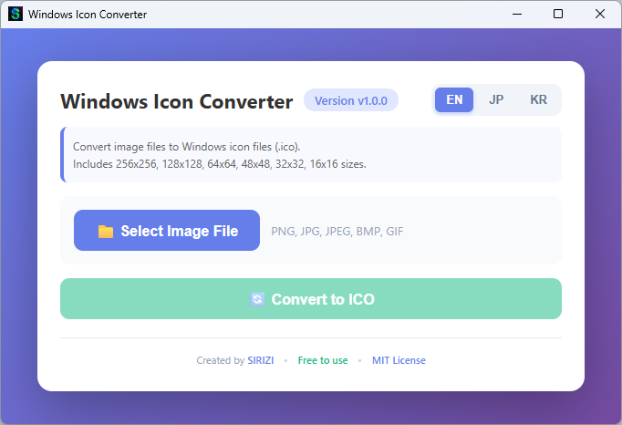
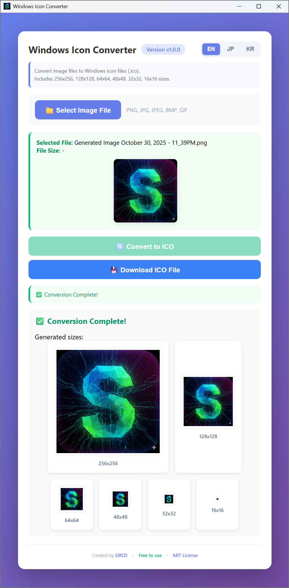

# 🎨 Windows アイコン変換

[](https://github.com/siriz/win-icon-converter/releases)
[](https://opensource.org/licenses/MIT)

画像ファイルをWindowsアイコンファイル(.ico)に即座に変換！インストール不要 - ポータブル実行ファイルを実行するだけです。

**言語**: [English](README.md) | [한국어](README.ko.md) | 日本語

**GitHubリポジトリ**: [https://github.com/siriz/win-icon-converter](https://github.com/siriz/win-icon-converter)

## 📸 スクリーンショット

<p align="center">
  
  
</p>

## ✨ 特徴

- 🚀 **軽量** - 約5MBの単一実行ファイル
- 🌐 **多言語対応** - 英語、韓国語、日本語サポート
- 📴 **オフライン動作** - インターネット接続不要
- 💼 **ポータブル** - インストール不要、どこでも実行可能
- 📏 **複数サイズ** - 256x256、128x128、64x64、48x48、32x32、16x16を生成
- 🖼️ **リアルタイムプレビュー** - 生成されたすべてのアイコンサイズを即座に表示
- 🎨 **多様な形式** - PNG、JPG、JPEG、BMP、GIFをサポート

## 📖 使用方法

1. アプリケーションを実行 (`win-icon-converter.exe`)
2. 右上で希望の言語を選択 (EN/JP/KR)
3. **"📁 画像ファイルを選択"** をクリックして画像を選択
4. **"🔄 ICOに変換"** をクリックして変換を開始
5. 生成されたすべてのアイコンサイズをプレビュー
6. **"💾 ICOファイルをダウンロード"** をクリックして希望の場所に保存

## 📥 ダウンロード

### 方法1: 直接ダウンロード（推奨）
リポジトリからすぐに使えるzipファイルをダウンロード:
- **[win-icon-converter.zip](win-icon-converter.zip)** (~2.4 MB)

zipファイルを解凍して `win-icon-converter.exe` を実行.

### 方法2: GitHubリリース
[**最新リリースをダウンロード**](https://github.com/siriz/win-icon-converter/releases/latest)

## 🛠️ ソースからビルド

### 必要条件
- Rust 1.70以上
- Node.js（フロントエンド開発用、オプション）

### ビルドコマンド

```powershell
# 自動バージョン命名を含む迅速なリリースビルド
.\build-release.ps1

# 手動ビルド
cd src-tauri
cargo build --release
```

リリースビルドは `src-tauri/target/release/` に `win-icon-converter.exe` を作成します.

### プロジェクト構造
```
win-icon-converter/
├── src-tauri/          # Rustバックエンド（Tauri）
│   ├── src/
│   │   ├── main.rs           # アプリケーションエントリーポイント
│   │   └── icon_converter.rs # ICO生成ロジック
│   └── Cargo.toml
├── ui/                 # フロントエンド（HTML/CSS/JS）
│   ├── index.html
│   ├── styles.css
│   ├── main.js
│   └── i18n.js         # 国際化
└── build-release.ps1   # ビルドスクリプト
```

## 🏗️ 技術スタック

- **バックエンド**: [Rust](https://www.rust-lang.org/) - 安全で高速なシステムプログラミング
- **フレームワーク**: [Tauri 2.x](https://tauri.app/) - 軽量デスクトップフレームワーク
- **画像処理**: [image-rs](https://github.com/image-rs/image) - Rust画像エンコード/デコード
- **フロントエンド**: HTML/CSS/JavaScript（i18nサポート付き）
- **プラグイン**: 
  - tauri-plugin-dialog - ネイティブファイルダイアログ
  - tauri-plugin-shell - 外部リンク処理
- **ビルド最適化**: LTO、サイズ最適化（`opt-level = "z"`）

## 📄 ライセンス

このプロジェクトはMITライセンスの下で配布されています - 詳細は[LICENSE](LICENSE)ファイルを参照してください。

**個人および商用プロジェクトで無料で使用可能！**

## 👤 作者

**SIRIZ**

- GitHub: [@siriz](https://github.com/siriz)
- プロジェクトリンク: [https://github.com/siriz/win-icon-converter](https://github.com/siriz/win-icon-converter)

## ⭐ サポート

このプロジェクトが役立つと思ったら、GitHubで⭐を付けてください！

---

Made with ❤️ by [SIRIZ](https://github.com/siriz)
