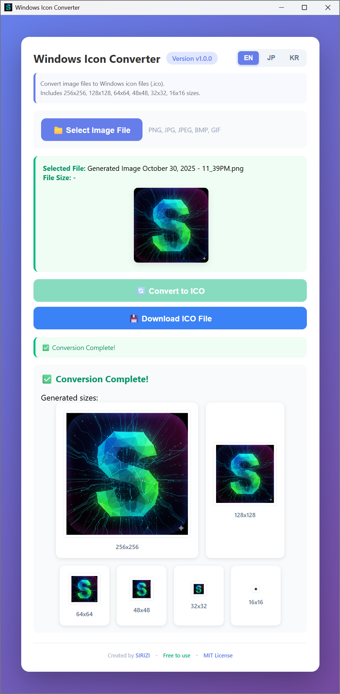

# 🎨 Windows Icon Converter

[](https://github.com/siriz/win-icon-converter/releases)
[](https://opensource.org/licenses/MIT)

Convert images to Windows icon files (.ico) instantly! No installation required - just run the portable executable.

**Languages**: English | [한국어](README.ko.md) | [日本語](README.ja.md)

**GitHub Repository**: [https://github.com/siriz/win-icon-converter](https://github.com/siriz/win-icon-converter)

## 📸 Screenshots

<p align="center" style="display: flex; align-items: flex-start; justify-content: center; gap: 10px;">
  
  
</p>

## ✨ Features

- 🚀 **Lightweight** - Single ~5MB executable
- 🌐 **Multilingual** - English, Korean, Japanese support
- 📴 **Offline** - No internet connection required
- 💼 **Portable** - No installation needed, run anywhere
- 📏 **Multiple Sizes** - Generates 256x256, 128x128, 64x64, 48x48, 32x32, 16x16
- 🖼️ **Live Preview** - Instantly view all generated icon sizes
- 🎨 **Various Formats** - Supports PNG, JPG, JPEG, BMP, GIF

## 📖 How to Use

1. Run the application (`win-icon-converter.exe`)
2. Select your preferred language (EN/JP/KR) in the top-right corner
3. Click **"📁 Select Image File"** to choose an image
4. Click **"🔄 Convert to ICO"** to start conversion
5. Preview all generated icon sizes
6. Click **"💾 Download ICO File"** to save to your desired location

## 📥 Download

### Option 1: Direct Download (Recommended)
Download the ready-to-use zip file from the repository:
- **[win-icon-converter.zip](win-icon-converter.zip)** (~2.4 MB)

Extract the zip file and run `win-icon-converter.exe`.

### Option 2: GitHub Releases
[**Download Latest Release**](https://github.com/siriz/win-icon-converter/releases/latest)

## 🛠️ Building from Source

### Prerequisites
- Rust 1.70 or higher
- Node.js (for frontend development, optional)

### Build Commands

```powershell
# Quick release build with automatic naming
.\build-release.ps1

# Manual build
cd src-tauri
cargo build --release
```

The release build creates `win-icon-converter.exe` in `src-tauri/target/release/`.

### Project Structure
```
win-icon-converter/
├── src-tauri/          # Rust backend (Tauri)
│   ├── src/
│   │   ├── main.rs           # Application entry point
│   │   └── icon_converter.rs # ICO generation logic
│   └── Cargo.toml
├── ui/                 # Frontend (HTML/CSS/JS)
│   ├── index.html
│   ├── styles.css
│   ├── main.js
│   └── i18n.js         # Internationalization
└── build-release.ps1   # Build script
```

## 🏗️ Tech Stack

- **Backend**: [Rust](https://www.rust-lang.org/) - Safe and fast systems programming
- **Framework**: [Tauri 2.x](https://tauri.app/) - Lightweight desktop framework
- **Image Processing**: [image-rs](https://github.com/image-rs/image) - Rust image encoding/decoding
- **Frontend**: HTML/CSS/JavaScript with i18n support
- **Plugins**: 
  - tauri-plugin-dialog - Native file dialogs
  - tauri-plugin-shell - External link handling
- **Build Optimization**: LTO, size optimization (`opt-level = "z"`)

## 📄 License

This project is licensed under the MIT License - see the [LICENSE](LICENSE) file for details.

**Free to use** for personal and commercial projects!

## 👤 Author

**SIRIZ**

- GitHub: [@siriz](https://github.com/siriz)
- Project Link: [https://github.com/siriz/win-icon-converter](https://github.com/siriz/win-icon-converter)

## ⭐ Support

If you find this project useful, please give it a ⭐ on GitHub!

---

Made with ❤️ by [SIRIZ](https://github.com/siriz)
